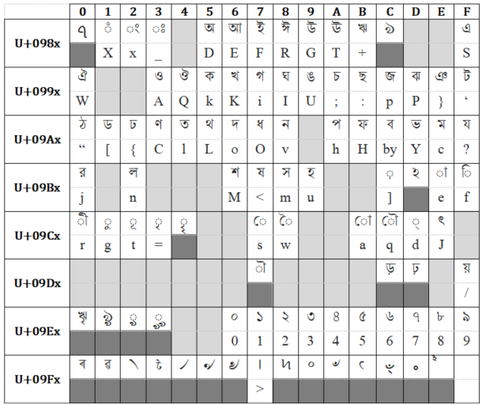

# speech_dataset / utils / keyboard

This directory contains khut_e.zip from which you can extract and install Meetei Mayek in Windows.
Installing khut_e will allow you to type in Meetei Mayek in windows.

#### Warning

- The character in the keyboard is not in the default system code page (1252) of the English (India) language you specified. This may cause compatibility problems in non-Unicode applications.

## 1. Keys

### 1.1. Normal Mode

### 1.2. Shift Mode

Hold Shift and Type.

### 1.3. Ctrl Mode

Hold Ctrl and Type. (Might not probably work if Ctrl is bound as part of shortcuts, eg., Ctrl+Z is undo so typing Z might not work.)

## 2. Font

Nirmala UI supports Meetei Mayek by default in windows. But it is preferred to download and install [Noto Sans Meetei Mayek](https://fonts.google.com/noto/specimen/Noto+Sans+Meetei+Mayek) from Google Fonts.

## 3. Bengali Keymap (Windows Default)

